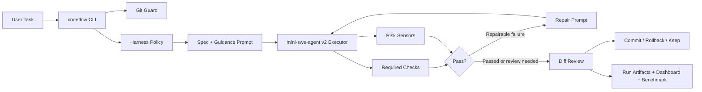
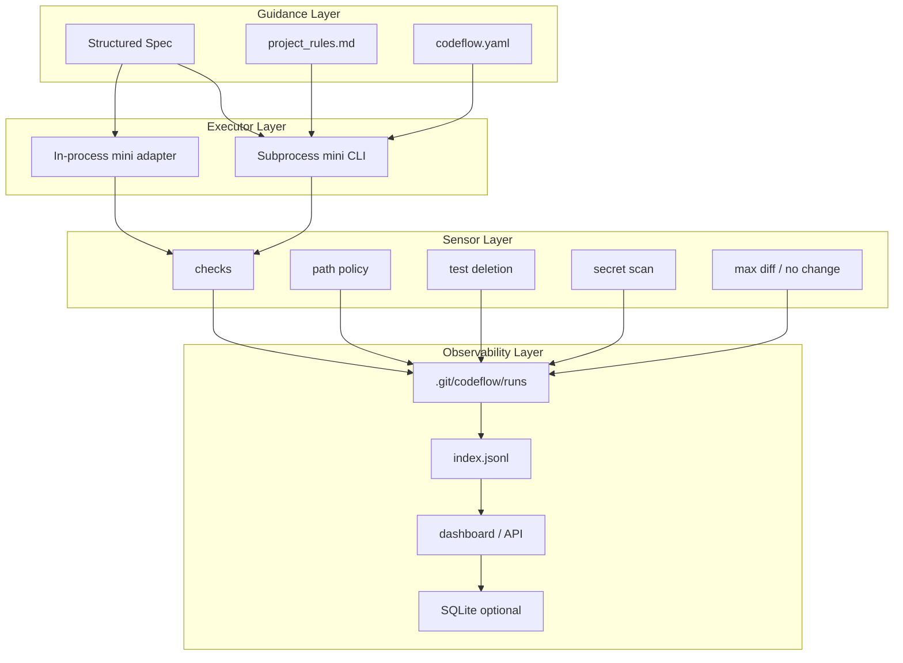

# CodeFlow Harness

CodeFlow Harness 是一个面向 Python 项目的 AI Coding Agent 可信执行与验证系统。它把仓库内集成的 `mini-swe-agent v2` 作为代码执行器，在外层补齐工程化能力：任务结构化、策略注入、Git 隔离、测试门禁、风险传感器、自动修复循环、人工治理、审计日志、可视化和 benchmark。

- 当前包名：`codeflow-agent`
- 当前版本：`0.1.0`
- Python 要求：`>=3.10`

```text
mini-swe-agent v2 = Executor
CodeFlow Harness = Guidance + Sensors + Control Loop + Governance + Observability + Evaluation
```

## 项目亮点

- **可信执行**：目标项目必须是干净 Git worktree，CodeFlow 会创建 `ai/*` 隔离分支后再让 agent 修改代码。
- **策略驱动**：通过 `.codeflow/codeflow.yaml` 声明 required checks、允许/禁止路径、diff 上限、测试要求、语义审查和提交门禁。
- **验证闭环**：执行 `pytest`、`ruff` 等 checks，失败后生成 repair prompt，最多自动修复 3 轮。
- **风险传感器**：检测 forbidden path、间接写 secret path、删除测试、无变更、大 diff、依赖变更、secret-like 内容、缺少测试变更等风险。
- **模型可选增强**：可用 OpenAI-compatible 配置启用语义 Spec 增强和 Diff Review；强制语义审查不可用时可按策略进入 `review_required`。
- **可观测性**：每次运行写入 prompt、mini log、trajectory、events、checks、sensor report、diff、review report 和 state；支持 inspect/search/summary/dashboard/serve/export。
- **评测体系**：内置 Harness-Bench、QuixBugs、BugsInPy、SWE-bench Lite/Verified mini subset 的准备、运行和汇总脚本。

## 架构示意





## 仓库结构

```text
.
├── codeflow/                  # CodeFlow Harness 主实现
├── codeflow/harness/          # policy、guidance、sensors、governance、observability
├── codeflow/storage/          # JSONL / SQLite run store
├── codeflow/server/           # 本地 dashboard 与 /api/* 服务
├── minisweagent/              # 已集成的 mini-swe-agent v2 源码
├── benchmark/                 # benchmark 任务、准备脚本、评测脚本和报告
├── examples/                  # todo_api / file_utils / student_manager 示例项目
├── tests/                     # CodeFlow 与 mini-swe-agent 测试
├── docs/                      # 设计、实现和阶段性报告
├── pyproject.toml             # 统一安装 codeflow 与 minisweagent
└── README.md                  # 项目入口文档
```

## 安装

推荐使用 `uv`：

```bash
uv sync
```

开发环境：

```bash
uv sync --group dev
```

可选完整依赖：

```bash
uv sync --extra full
```

也可以使用 pip：

```bash
pip install -e .
```

安装后会暴露这些命令：

| 命令 | 作用 |
| --- | --- |
| `codeflow` | CodeFlow Harness CLI |
| `mini` | mini-swe-agent CLI |
| `mini-swe-agent` | mini-swe-agent CLI 别名 |
| `mini-extra` / `mini-e` | mini-swe-agent 扩展工具 |

## 快速开始

目标项目必须是一个干净的本地 Git 仓库。可以先用仓库里的示例项目体验：

```bash
cd examples/todo_api
git init
git add .
git -c user.email=codeflow@example.local -c user.name=CodeFlow commit -m init
cd ../..
```

初始化 CodeFlow 配置：

```bash
codeflow init --repo ./examples/todo_api
```

检查目标项目环境：

```bash
codeflow doctor --repo ./examples/todo_api
```

只生成 prompt，不调用 agent：

```bash
codeflow run \
  --repo ./examples/todo_api \
  --task "给 Todo 增加 due_date 字段，并补充测试" \
  --checks "pytest -q" \
  --dry-run \
  --no-commit
```

执行完整 Harness 流程，但不自动提交：

```bash
codeflow run \
  --repo ./examples/todo_api \
  --task "给 Todo 增加 due_date 字段，并补充测试" \
  --checks "pytest -q" \
  --checks "ruff check ." \
  --max-repair-rounds 3 \
  --no-commit
```

不带 `--no-commit` 时，CodeFlow 会在验证和审查后要求人工选择：

```text
commit / rollback / keep
```

commit 前会按 policy 重新运行 checks 和 sensors。

## 模型配置

CodeFlow 默认不会写入 mini-swe-agent 的全局配置。运行时会读取启动目录下的 `.env`，也可以用 `CODEFLOW_ENV_FILE` 指向其他文件。

```bash
model_id="deepseek-v4-flash"
api_key="sk-..."
base_url="https://dashscope.aliyuncs.com/compatible-mode/v1"
```

这些值只会映射到 mini 子进程或语义审查调用环境中：

| `.env` 字段 | 映射 |
| --- | --- |
| `model_id` | `MSWEA_MODEL_NAME` 或 `--model openai/{model_id}` |
| `api_key` | `OPENAI_API_KEY` |
| `base_url` | `OPENAI_BASE_URL` / `OPENAI_API_BASE` |

也可以直接使用标准环境变量：

```bash
export MSWEA_MODEL_NAME="openai/deepseek-v4-flash"
export OPENAI_API_KEY="sk-..."
export OPENAI_BASE_URL="https://dashscope.aliyuncs.com/compatible-mode/v1"
```

如果本地 `mini` 不在 PATH 中：

```bash
export CODEFLOW_MINI_COMMAND="python -m minisweagent.run.mini"
```

默认执行器是 subprocess CLI。需要更紧密的事件记录和实时 policy 阻断时，可启用 in-process adapter：

```bash
export CODEFLOW_MINI_EXECUTOR=inprocess
```

mini 默认最多运行 3600 秒，可按需调整：

```bash
export CODEFLOW_MINI_TIMEOUT_SECONDS=1800
```

语义 Spec / Diff Review 默认复用同一套 OpenAI-compatible 配置，也可以用 `CODEFLOW_SEMANTIC_MODEL` 单独指定审查模型。

## Harness Policy

`codeflow init` 会在目标项目写入：

```text
.codeflow/project_rules.md
.codeflow/codeflow.yaml
```

示例 policy：

```yaml
harness:
  required_checks:
    - pytest -q
    - ruff check .

  max_repair_rounds: 3
  max_diff_lines: 500

  allowed_paths:
    - app/
    - tests/

  forbidden_paths:
    - .env
    - .env.*
    - secrets/
    - credentials/
    - "*.pem"
    - "*.key"

  high_risk_paths:
    - app/auth/
    - app/db/
    - migrations/
    - config/

  require_test_change: true
  allow_dependency_change: false
  allow_delete_tests: false
  allow_shell_checks: false

  semantic_spec: true
  semantic_review: true
  require_semantic_review: false
  semantic_timeout_seconds: 60
  semantic_max_diff_chars: 20000
  semantic_fail_open: true
  semantic_required_for_paths:
    - app/auth/
    - migrations/

  governance:
    block_commit_on_failed_checks: true
    block_commit_on_high_risk: false
    require_human_approval: true
    rerun_checks_before_commit: true
```

优先级：

```text
CLI 参数 > codeflow.yaml > project_rules.md > 默认值
```

`required_checks` 默认不经 shell 解释，CodeFlow 会用 `shlex.split` 后直接执行命令。确实需要管道、重定向或 `&&` 时，必须设置 `allow_shell_checks: true` 并使用显式前缀：

```yaml
harness:
  allow_shell_checks: true
  required_checks:
    - "shell: cd app && pytest -q"
```

这类 check 应只来自可信配置。CodeFlow 会提示 `rm -rf`、`curl | sh`、`wget | sh`、写 `.env`、`sudo`、`chmod 777`、`docker run --privileged` 等高风险片段。

## 内置 Sensors

| Sensor | 作用 | 典型行为 |
| --- | --- | --- |
| `check_commands` | 汇总 required checks | checks 失败时 high |
| `shell_check_risk` | 扫描 shell check 高风险片段 | warning |
| `forbidden_path` | 检测 `.env`、secret、key 等敏感路径变更 | high blocking |
| `forbidden_path_write` | 检测新增代码间接写禁改路径 | high blocking |
| `allowed_path` | 配置 `allowed_paths` 后阻止越界修改 | high blocking |
| `high_risk_path` | 标记认证、数据库、迁移、配置等高风险路径 | warning 或 high |
| `test_deletion` | 检测删除测试函数、断言或 `pytest.raises` | high blocking |
| `missing_test_change` | 业务代码变更但没有测试变更 | medium warning |
| `dependency_change` | 检测依赖文件变更 | policy 禁止时 high |
| `secret_like_content` | 检测新增 API key / token / secret-like 内容 | high blocking |
| `max_diff` | 限制过大 diff | high blocking |
| `no_change` | 防止没有改代码但测试通过被误判成功 | failure |

可自动 repair 的失败包括 checks、`dependency_change`、`missing_test_change`、`no_change`。敏感路径、secret、删除测试、大 diff、越界路径等风险不会盲目修复，会进入审查或阻断路径。

## 运行结果与可观测性

一次运行会写入目标仓库的 Git 目录，不污染工作区 diff：

```text
.git/codeflow/runs/{run_id}/
├── policy.json
├── spec.json
├── initial_prompt.md
├── prompt_0.txt
├── mini_run_0.log
├── mini_run_0.trajectory.json
├── mini_run_0.events.jsonl
├── checks_round_0.json
├── sensor_report_round_0.json
├── diff.patch
├── semantic_review.json
├── review_summary.json
├── review_report.md
└── state.json
```

常用查看命令：

```bash
codeflow inspect --repo ./examples/todo_api --latest
codeflow inspect --repo ./examples/todo_api --limit 5
codeflow search --repo ./examples/todo_api --status checks_failed
codeflow summary --repo ./examples/todo_api
codeflow report --repo ./examples/todo_api --latest
```

生成静态 dashboard：

```bash
codeflow dashboard \
  --repo ./examples/todo_api \
  --out ./codeflow-dashboard.html
```

启动本地 dashboard 和 JSON API：

```bash
codeflow serve \
  --repo ./examples/todo_api \
  --host 127.0.0.1 \
  --port 8765
```

多仓库、Bearer token 和 SQLite 索引：

```bash
codeflow serve \
  --repo ./repo1 \
  --repo ./repo2 \
  --token "$CODEFLOW_DASHBOARD_TOKEN" \
  --sqlite-db ~/.codeflow/runs.db
```

导出 run artifact：

```bash
codeflow export \
  --repo ./examples/todo_api \
  --latest \
  --out ./codeflow-run.zip
```

`codeflow export` 默认不包含 prompt、mini 日志和 trajectory；需要排查时再显式加入：

```bash
codeflow export \
  --repo ./examples/todo_api \
  --latest \
  --out ./codeflow-run-debug.zip \
  --include-prompts \
  --include-logs \
  --include-trajectory
```

prompt、mini 日志、trajectory、diff、state 和 check 输出写入前会做常见 API key、token、private key、secret-like 内容脱敏。脱敏是防护层，不替代 policy 对敏感路径和 secret-like 内容的阻断。

## Benchmark

兼容入口：

```bash
python benchmark/run_benchmark.py
```

推荐直接使用新版评测脚本：

```bash
python benchmark/scripts/run_eval.py \
  --tasks benchmark/tasks/harness_bench.yaml \
  --method codeflow_full
```

支持的方法：

| method | 说明 |
| --- | --- |
| `checks_only` | 只运行原始仓库 checks，作为 baseline |
| `raw_mini` | 直接运行 mini-swe-agent，再采集 checks 和 review |
| `codeflow_basic` | 使用 CodeFlow prompt、checks 和 repair loop，不跑完整 sensors |
| `codeflow_full` | 完整 Harness：policy、sensors、repair loop、review |

当前 tracked benchmark 输入包括 Harness-Bench、QuixBugs、BugsInPy youtube-dl、SWE-bench Lite/Verified mini subset。近期真实 LLM 汇总报告位于 `benchmark/reports/current_real_results.md`，共 80 条结果记录：

| method | records | checks_passed | pass_rate | unsafe |
| --- | ---: | ---: | ---: | ---: |
| `checks_only` | 40 | 0/40 | 0.0% | 0 |
| `codeflow_full` | 40 | 40/40 | 100.0% | 0 |

这些结果是当前小子集和当前模型/环境下的工程回归记录，不代表全量 SWE-bench 结论。`benchmark/generated/`、`benchmark/workspaces/`、`benchmark/results/` 和 `benchmark/datasets/` 是本地生成或第三方数据目录，默认不入库。

## 开发与验证

常用本地验证：

```bash
uv run ruff check .
uv run mypy codeflow
uv run pytest -q
git diff --check
```

CI 在 Python 3.11 和 3.12 上运行：

```bash
uv sync --locked --group dev
uv run ruff check .
uv run mypy codeflow
uv run pytest -q --cov=codeflow --cov-report=term-missing --cov-fail-under=70
```

CI 默认排除 Docker/Podman、Singularity、SWE-bench container、extra environment 和真实 API fire tests。完整环境测试需要本机额外提供容器运行时、外部 provider API key 和相关可选依赖。

## 相关文档

- `docs/PROJECT_OVERVIEW.md`：当前项目全景、实现状态和边界。
- `docs/CODEFLOW_IMPLEMENTATION.md`：核心模块和执行链路说明。
- `docs/harness_design.md`：Harness Engineering 设计说明。
- `benchmark/reports/current_real_results.md`：当前真实 LLM benchmark 汇总。
- `benchmark/reports/DATASET_STATUS.md`：tracked benchmark 数据集状态。

## 当前边界

- 语义 Spec / Diff Review 依赖 OpenAI-compatible 模型配置；模型质量仍需要人工评估。
- 高风险业务语义变更仍需要人工确认，CodeFlow 提供风险定位和提交门禁，不替代代码审查。
- Observability 已支持本地 dashboard、多仓库服务、token 和 SQLite 索引，但还不是完整多用户平台。
- BugsInPy 和 SWE-bench 当前主要是可复现小子集，扩大覆盖面仍是后续工作。
- `allow_shell_checks` 默认关闭；开启后仍应只使用可信项目配置。
